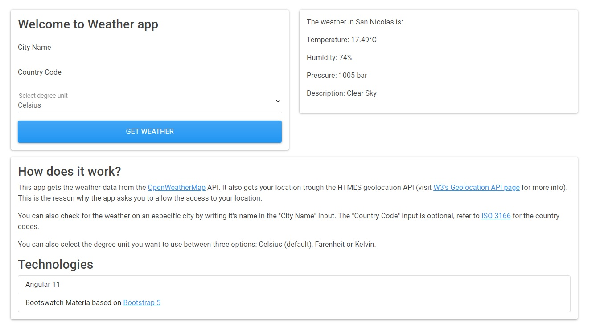

# WeatherApp

As simple as it gets: an app where you can check how's the weather in your city, or any city in the world!

## Technologies

This project uses [Angular 11](https://angular.io) as frontend's main framework.
The style of this app was given thanks to [Bootswatch Materia](https://bootswatch.com/materia/) theme based in Bootstrap 5.
The weather data is retrieved from [Open Weather Map's](https://openweathermap.org/current) API.
This app uses [HTML's geolocation API](https://w3c.github.io/geolocation-api/) to obtain your location, so be sure to allow the necessary permissions!

## Demo
You can see a working demo [here.](https://giantempo.github.io/weatherApp/)

## Preview
